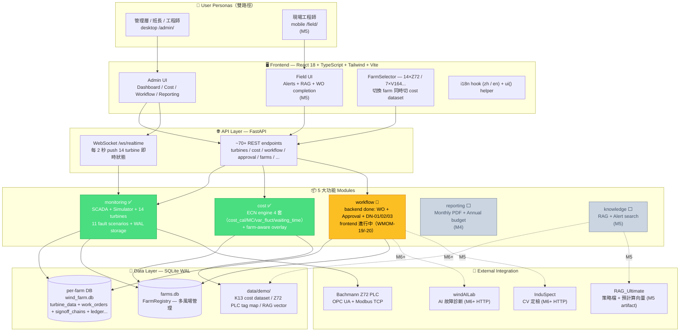
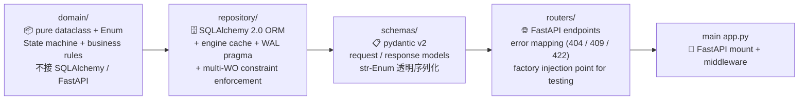
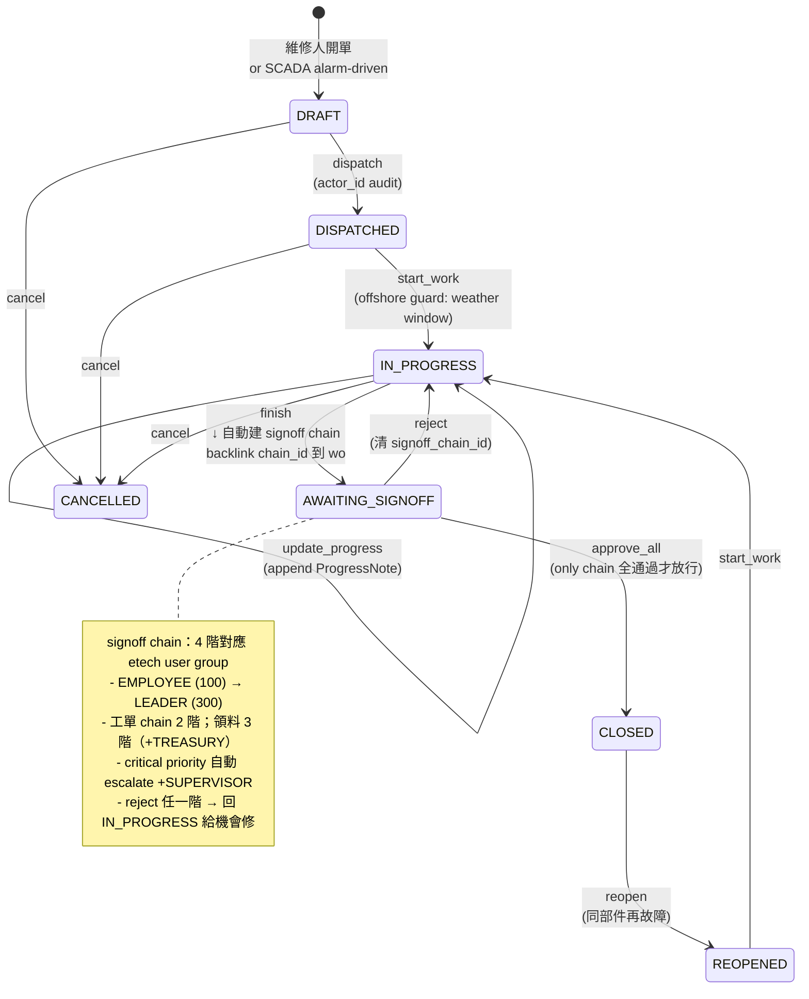
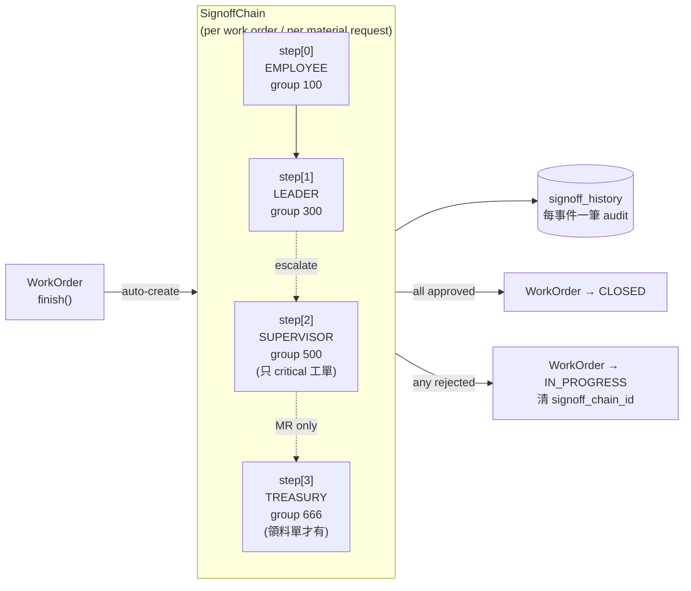
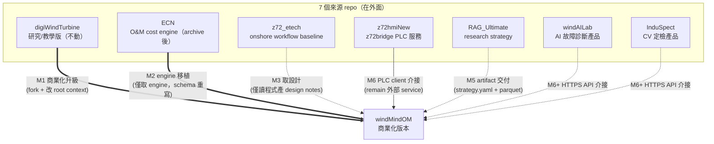
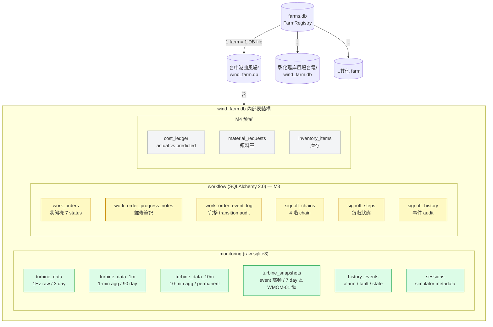
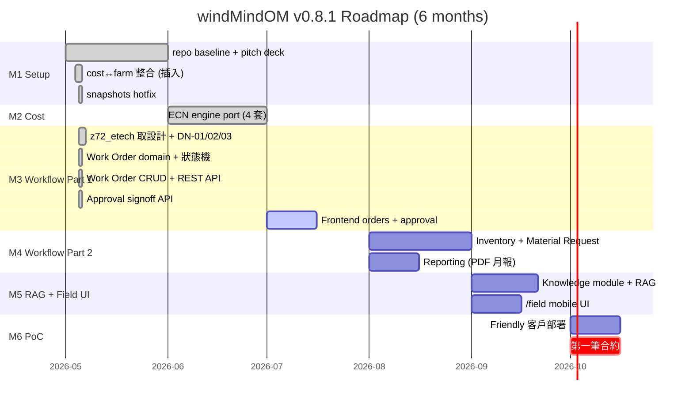

# windMindOM 系統架構全貌

> 版本：v0.8.1（2026-05-05 — M3 backend 完成）
> 受眾：第一次接觸專案的同仁、潛在客戶 demo、partner 對接窗口
> 一張圖看完整系統 → 然後依興趣往下看細節圖

---

## 1. 一張圖看全貌

**圖例**：🟢 已完成 / 🟡 進行中 / ⚪ 規劃中

---

## 2. 模組內部分層（典型 pattern — 以 workflow 為例）

每個 module 走相同四層分層，pure Python → 漸增 framework 依賴：

**為什麼分這四層**：
- **domain** 純 Python 可單獨測試（73 tests），未來換 ORM/框架不影響邏輯
- **repository** 集中 DB 細節 + business rule（如「一台風機 ≤ 3 OPEN 工單」）
- **schemas** 對外 API contract，與 domain 對齊但不共用 class（pydantic vs dataclass）
- **routers** 薄層 — 只做 HTTP / DI / error mapping

---

## 3. Work Order 狀態機（M3 主軸）

**整合點**：
- 工單 finish → `signoff_repository.create_chain_for_work_order()` 自動建 chain
- 簽核 last step approved → 自動觸發 `work_order.approve_all()` → CLOSED
- 簽核任一階 reject → 自動 `work_order.reject(reason)` → IN_PROGRESS
- 失敗時 API 回 200 + `subject_transition_error` 欄位（不藏 chain 已決定的事實）

---

## 4. Approval 4 階 signoff chain

**設計重點（DN-02 walkthrough confirmed）**：
- 線性簽核（schema 預留 `parallel_group_id` 給未來並行簽，目前 NotImplementedError）
- 完整 `signoff_history` 給 KPI 用（誰退最多 / 哪類常被退）
- POST `/work-orders/{id}/approve` 強制檢查 `chain.overall_status == APPROVED`（review fix #4 — 防 bypass）

---

## 5. 與 7 個來源 repo 的關係

| Repo | 角色 | windMindOM 對它做什麼 |
|------|------|---------------------|
| **digiWindTurbine** | 物理模擬 + SCADA 平台 | 不動，留作研究 / 教學版本 |
| **ECN** | O&M cost calculation engine | M2 完成移植進 `modules/cost/`；原 repo archive |
| **z72_etech** | 益泰運維廠商 onshore workflow | M3 取設計（design notes 在 `docs/design-notes/m3/`），**不取程式** |
| **z72hmiNew** | z72bridge PLC service | 留外面（z72 服務性 repo）；M1 已整合 OPC UA client |
| **windAILab** | AI 故障診斷產品 | 留外面（**另一公司業務**）；M6+ HTTP API 介接 |
| **RAG_Ultimate** | research RAG strategy | 留外面（research line）；M5 artifact 交付 |
| **InduSpect** | CV 定檢產品 | 留外面（independent product）；M6+ HTTP API 介接 |

---

## 6. Storage 結構（per-farm）

**設計重點**：
- **per-farm DB** — 每個風場 `wind_farm.db`（在 `modules/monitoring/data/farms/{farm_id}/`），由 `FarmRegistry` 集中管理
- **monitoring 用 raw sqlite3 + WAL pragma**；**workflow 用 SQLAlchemy 2.0 + 同 WAL**，並存無衝突
- **WAL mode + busy_timeout=5s** 給多 thread / 多 connection 並發讀寫
- **Retention 政策**（WMOM-20260505-01 hotfix 後）：
  - turbine_data raw 3 天 / 1m agg 90 天 / 10m permanent
  - turbine_snapshots **7 天**（避免 retroactive write 失控膨脹）

---

## 7. 6-month roadmap timeline

---

## 8. 一句話總結

> **windMindOM = digiWindTurbine 商業化升級**：原本物理模擬 + SCADA 平台 → 加上 5 大運維模組（monitoring / cost / workflow / reporting / knowledge）+ 雙 persona UI（管理 desktop + 現場 mobile）+ simulator-first demo（無實場可成立 = sales killer feature）+ 與 6 個 partner repo 的清楚邊界（API / artifact 介接，不 fork 程式碼）。

---

## 9. 進一步閱讀

| 想知道 | 看哪 |
|---|---|
| 產品定位 / ICP / 5 大功能 | [`docs/product/PRODUCT_VISION.md`](../product/PRODUCT_VISION.md) |
| 5 modules 詳細設計 + 整合 | [`docs/product/MVP_ARCHITECTURE.md`](../product/MVP_ARCHITECTURE.md) |
| 6 個月路線圖 | [`docs/product/ROADMAP.md`](../product/ROADMAP.md) |
| 重大架構決策（v0.5 → v0.8.1 pivot 等） | [`docs/product/decision_log.md`](../product/decision_log.md) |
| M3 工單 / 簽核 / 庫存設計 | [`docs/design-notes/m3/`](../design-notes/m3/) |
| 既有 digiWT 物理模型細節 | [`docs/legacy/digiwt_project_notes.md`](../legacy/digiwt_project_notes.md) |
| API endpoint 規格 | [`docs/API_GUIDE.md`](../API_GUIDE.md) |
| 工單實際 lifecycle code | [`modules/workflow/`](../../modules/workflow/) |
| 任務追蹤 | [`ISSUES.md`](../../ISSUES.md) + [`STATUS.yaml`](../../STATUS.yaml) |
